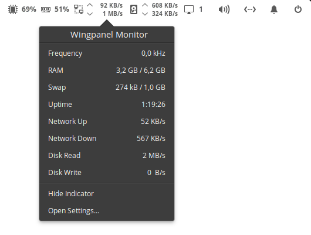
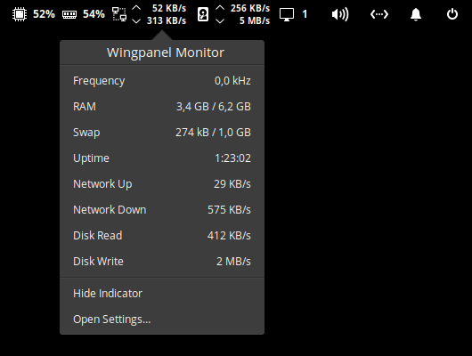
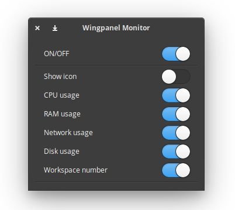

<p align="center">
  
</p>
<h1 align="center">Wingpanel System Monitor</h1>

## About

Wingpanel System Monitor is a status indicator that displays current system resources usage information in elementary OS Wingpanel.

Being this one of my first Vala applications I'm sure that the code can be improved, so:

- If you find any problems while running the application please report it through an issue.
- Pull requests are welcome.
- Feedback and suggestions are always welcome as well.

### Features:

- Displays the following system resources information:

    - CPU usage
    - CPU temperature
    - RAM memory usage
    - Network throughput
    - Disk throughput
    - Current workspace number

- Additionally in the popover it displays the following information:

    - Swap memory usage
    - System uptime
    - System load average

### Requirements

- elementary OS 5.1.7 Hera

## Screenshots

### Indicator:

### Popover:


### Settings:


## Building and installation from source

You'll need the following dependencies:

```
libglib2.0-dev
libgtop2-dev
libgranite-dev
libgtk-3-dev
libwingpanel-2.0-dev
meson
valac
```

You can install them running:

```
sudo apt install libgtop2-dev libgranite-dev libgtk-3-dev libwingpanel-2.0-dev meson valac
```

Run `meson` to configure the build environment and then `ninja` to build

```
meson build --prefix=/usr
cd build
ninja
```

To install, use `ninja install`

```
sudo ninja install
com.github.casasfernando.wingpanel-indicator-sysmon
```

## Installation using the deb package

You can also find a deb package available with every release in the releases page.
To install it you just need to download it and run:

```
sudo dpkg -i wingpanel-indicator-sysmon_<release>_amd64.deb

## Special thanks and credits
 - [Plugaru T.](https://github.com/PlugaruT/) for developing the [original project](https://github.com/PlugaruT/wingpanel-monitor).
 - Network widget icon (net-symbolic.svg) made by [Freepik](https://www.freepik.com) from [https://www.flaticon.com/](www.flaticon.com)
 - [Mathieu Rousseau](https://github.com/mathieurousseau) for developing the [disk widget code](https://github.com/mathieurousseau/wingpanel-monitor/commit/3cf5b9ebde5639be041e713d79119f6add99a1ac)
 - Disk widget icon (disk-symbolic.svg) made by [Pixel perfect](https://www.flaticon.com/authors/pixel-perfect) from [https://www.flaticon.com/](www.flaticon.com)
 - Application [icon](https://www.deviantart.com/johnlongview/art/Activity-Monitor-OS-X-icon-iOS7-style-395145475) by [johnlongview](https://www.deviantart.com/johnlongview)
